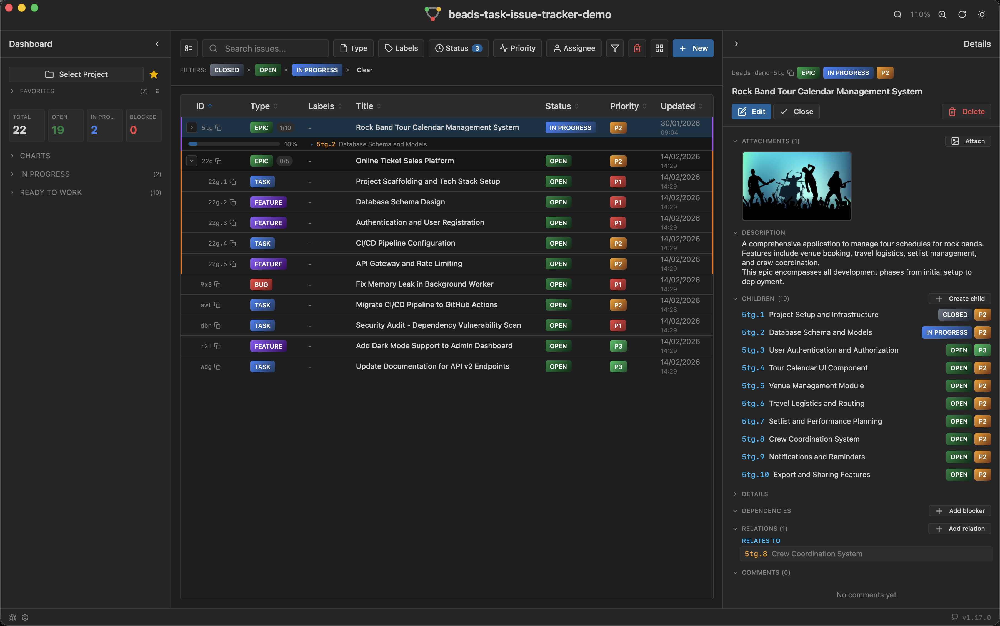

# Beads Task-Issue Tracker

A lightweight, standalone desktop application for managing [Beads](https://github.com/steveyegge/beads) issues outside of your IDE.



## Why This App?

[bd Beads](https://github.com/steveyegge/beads) is an AI-native issue tracker that stores issues directly in your codebase (in a `.beads` folder).

> [!IMPORTANT]
> **A human interface for AI-piloted issue tracking**
>
> The `bd` CLI is designed for AI agents — they create issues, update statuses, and pilot workflows programmatically. But **humans need visibility and control** over what the AI is doing.
>
> This application lets you **observe** what the AI is driving, and **step in** to edit, correct, or redirect at any point. The workflow is collaborative — the AI pilots through `bd`, and you use this app as your control panel.
>
> We follow the `bd` CLI — we don't define the format, we read what `bd` writes and present it for humans. If `bd` evolves, we adapt. If `bd` ever becomes purely machine-to-machine with no human-interpretable output, we freeze at the last meaningful version.
>
> *See **[docs/philosophy.md](docs/philosophy.md)** for the full design rationale.*

Planet57's [vscode-beads extension](https://marketplace.visualstudio.com/items?itemName=planet57.vscode-beads) provides an excellent interface for managing these issues.
However, **VS Code can be resource-intensive**.
If you want to browse and manage your Beads issues without keeping VS Code open, this standalone app is for you.

This project is a reimplementation of the Beads UI as a native desktop app using [Tauri](https://tauri.app/), resulting in:
- **Minimal memory footprint** (~50MB vs VS Code's 500MB+)
- **Fast startup** (instant vs several seconds)
- **Dedicated window** for issue management
- **Works alongside any editor** (Vim, Emacs, JetBrains, etc.)

## Features

### Live Updates — No Polling
The app uses a **native file watcher** on the `.beads` directory. When an AI agent (or anyone) creates, updates, or closes an issue via `bd`, the change appears in real time — no refresh button, no polling interval. This is critical when monitoring AI-driven workflows where issues change rapidly.

### Dependencies & Relations
- **Add/remove blockers** from the issue preview via a search modal
- **Navigate** to any dependency or relation by clicking its row (short ID + title)
- **Blocked indicator** in the issue table for issues with unresolved blockers
- **Add/remove relations** (`relates-to`, `duplicates`, `supersedes`, `caused-by`, etc.) between any issues, including closed ones
- **Dynamic relation types** adapted to your CLI client (`bd` or `br`)

### Core
- **Dashboard**: Visual overview of issues by status, type, and priority
- **Issue Management**: Create, edit, close, and comment on issues
- **Epic Hierarchy**: Parent/child relationships with collapsible groups and inline progress bars
- **Multi-Project Support**: Save favorite projects and switch between them instantly

### Attachments
- **Image Attachments**: Attach and preview screenshots directly in issues (thumbnail gallery)
- **Markdown Attachments**: Attach `.md` files with full preview, inline editing, and save workflow
- **Markdown Search**: Find text within markdown previews with match highlighting and navigation (`Cmd/Ctrl+F`)
- **Gallery Navigation**: Browse multiple attached files with arrow keys or buttons

### Filtering & Display
- **Extended Status Support**: All `bd` statuses handled — `deferred`, `pinned`, `hooked`, and `tombstone` (deleted) issues filtered from default view
- **Advanced Filters**: Multi-select filters by type, status, priority, labels, and assignee
- **Exclusion Filters**: Hide specific issues by criteria (inverse filtering)
- **Search**: Find issues by title, ID, or description
- **Column Customization**: Show/hide and configure table columns per project
- **Smart Short IDs**: Common prefix is automatically detected and hidden for readability
- **Collapsible Sections**: All preview sections (description, attachments, dependencies, etc.) are independently collapsible with persistent state

### Bulk & Productivity
- **Multi-Select**: Toggle multi-select mode to select issues individually or all at once
- **Bulk Delete**: Delete multiple selected issues in one operation
- **Sortable Columns**: Click any column header to sort (ascending, descending, or clear)
- **Zoom Controls**: Adjust UI scale from 75% to 150% (Alt+Click to reset)

### Settings & Tools
- **CLI Client Selector**: Switch between [`bd`](https://github.com/steveyegge/beads) (Go) and [`br`](https://github.com/Dicklesworthstone/beads_rust) (Rust) via Settings (`Cmd/Ctrl+,`)
- **Theme System**: 4 themes — Classic Light, Classic Dark, Dark Flat, and Neon — with per-theme badge styling, glow effects, and one-click cycling via the header icon
- **Debug Panel**: Live log viewer with auto-refresh, accessible via `Cmd/Ctrl+Shift+L`
- **Database Repair**: Automatic detection and repair of schema migration issues
- **Keyboard Shortcuts**: `Cmd/Ctrl+,` (settings), `Cmd/Ctrl+F` (search in markdown), `Cmd/Ctrl+Shift+L` (debug logs), arrow keys (gallery navigation)

## My Workflow

Beyond just viewing issues, this app is part of a broader development workflow powered by [Claude Code](https://claude.ai/code):

- **Centralized task management**: Beads issues live in the codebase, making them accessible to AI coding assistants
- **AI-driven development**: Claude Code can read, create, and update issues directly, keeping context within the coding session
- **External bug sync**: Custom commands can import bugs from external systems (Jira, Redmine, etc.) into Beads
- **Daily planning**: Quickly review and prioritize tasks for the day without switching contexts

## How Attachments Work

The `bd` CLI has no built-in attachment support. This app implements its own attachment system by repurposing the `--external-ref` field — originally designed for storing a single external reference (like `gh-9` or `jira-ABC`) — to hold file paths.

When you attach a file to an issue:
1. The file is copied into `.beads/attachments/{issue-id}/`
2. Its absolute path is stored in the issue's `external_ref` field via `bd update --external-ref`
3. The app parses each line of `external_ref` and categorizes it by extension (image, markdown, or external reference)

This means the attachment storage lives inside the `.beads` directory and gets versioned alongside your issues.

> **For developers**: If you want to script attachment creation (e.g., automatically attach files when creating issues), see the detailed technical documentation in **[docs/attachments.md](docs/attachments.md)**.

## Prerequisites

> **Important**: This app requires the Beads CLI (or a compatible fork) to be installed on your system. It acts as a graphical interface for the `bd` command-line tool.
>
> **Recommended: bd 0.49.x** — This is the last stable version with embedded Dolt and native file watcher support. Do **not** upgrade to bd 0.50–0.56+ which switched to server mode, introducing regressions for standalone desktop use (polling instead of file watching, server lifecycle management, single-project-per-port). See [beads#2050](https://github.com/steveyegge/beads/issues/2050) for details.

1. **Install the Beads CLI** (`bd`)

   Follow the installation instructions on the official repository:

   **[https://github.com/steveyegge/beads](https://github.com/steveyegge/beads)**

   ```bash
   # Quick install (check the repo for the latest method)
   curl -fsSL https://raw.githubusercontent.com/steveyegge/beads/main/scripts/install.sh | bash
   ```

   **Alternative**: You can also use [beads_rust](https://github.com/Dicklesworthstone/beads_rust) (`br`), a Rust port frozen at the classic SQLite + JSONL architecture. After installing, go to **Settings** (`Cmd/Ctrl+,`) and select `br` as the CLI client.

2. **Initialize Beads in your project**

   ```bash
   cd your-project
   bd init
   ```

3. **Verify installation**

   ```bash
   bd --version
   ```

## Installation

### Download

Download the latest release for your platform from the [Releases](https://github.com/w3dev33/beads-task-issue-tracker/releases) page:

- **macOS**: `.dmg` file (Apple Silicon & Intel)
- **Windows**: `.msi` or `.exe` installer
- **Linux**: `.deb` (Debian/Ubuntu) or `.AppImage`

### macOS: First Launch

macOS may block the app because it's not signed with an Apple Developer certificate. You'll see a message saying the app "is damaged and can't be opened."

**To fix this**, run the following command after installing:

```bash
xattr -cr /Applications/Beads\ Task-Issue\ Tracker.app
```

Then open the app normally. This only needs to be done once.

### Build from Source

```bash
# Clone the repository
git clone https://github.com/w3dev33/beads-task-issue-tracker.git
cd beads-task-issue-tracker

# Install dependencies
pnpm install

# Run in development mode
pnpm dev

# Build for production
pnpm tauri:build
```

## Tech Stack

This application is built with modern web technologies, packaged as a native desktop app:

| Layer | Technology | Description |
|-------|------------|-------------|
| **Desktop** | [Tauri 2](https://tauri.app/) | Rust-based framework for building lightweight native apps |
| **Framework** | [Nuxt 4](https://nuxt.com/) | Vue 3 meta-framework running in SPA mode |
| **UI Components** | [shadcn-vue](https://www.shadcn-vue.com/) | Beautifully designed, accessible component library |
| **Styling** | [TailwindCSS 4](https://tailwindcss.com/) | Utility-first CSS framework |
| **Language** | TypeScript / Rust | Type-safe frontend with Rust backend |

## Related Projects

- [bd Beads](https://github.com/steveyegge/beads) - The AI-native issue tracker by Steve Yegge
- [Beads VS Code Extension](https://marketplace.visualstudio.com/items?itemName=planet57.vscode-beads) - The Planet57 VS Code extension
- [Community Tools](https://github.com/steveyegge/beads/blob/main/docs/COMMUNITY_TOOLS.md) - Other Beads community projects

## Contributing

Contributions are welcome! Please feel free to submit issues and pull requests.

## License

[MIT](LICENSE) - Laurent Chapin

---

## Acknowledgments

This project was developed with the assistance of [Claude Code](https://claude.ai/code), Anthropic's AI-powered coding assistant.
