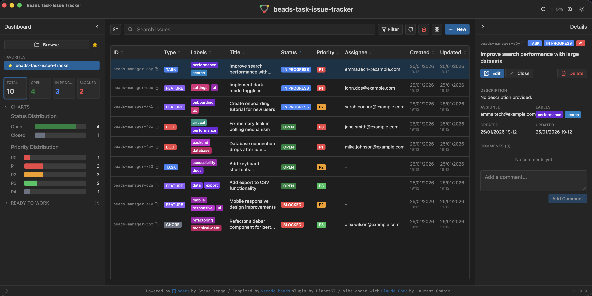

# Beads Task-Issue Tracker

A lightweight, standalone desktop application for managing [Beads](https://github.com/steveyegge/beads) issues outside of your IDE.



## Why This App?

[bd Beads](https://github.com/steveyegge/beads) is an AI-native issue tracker that stores issues directly in your codebase (in a `.beads` folder). 

Planet57's [vscode-beads extension](https://marketplace.visualstudio.com/items?itemName=planet57.vscode-beads) provides an excellent interface for managing these issues.
However, **VS Code can be resource-intensive**.
If you want to browse and manage your Beads issues without keeping VS Code open, this standalone app is for you.

This project is a reimplementation of the Beads UI as a native desktop app using [Tauri](https://tauri.app/), resulting in:
- **Minimal memory footprint** (~50MB vs VS Code's 500MB+)
- **Fast startup** (instant vs several seconds)
- **Dedicated window** for issue management
- **Works alongside any editor** (Vim, Emacs, JetBrains, etc.)

## Features

Core features from the original VS Code extension:
- **Dashboard**: Overview of issue counts by status, type, and priority
- **Issue List**: Filterable, sortable table with quick actions
- **Issue Details**: Full view with description, comments, and metadata
- **Create/Edit Issues**: Complete form with all Beads fields
- **Comments**: Add and view comments on issues
- **Search**: Filter issues by title, ID, or description
- **Dark/Light Theme**: Toggle via settings

Additional features:
- **Multi-Project Favorites**: Save multiple project paths and quickly switch between them — perfect for managing issues across several local repositories
- **Project Browser**: Navigate your filesystem to find and select Beads projects
- **Lightweight Sync**: Automatic synchronization with Beads database every 5 seconds, minimizing CPU usage while keeping data up-to-date

## My Workflow

Beyond just viewing issues, this app is part of a broader development workflow powered by [Claude Code](https://claude.ai/code):

- **Centralized task management**: Beads issues live in the codebase, making them accessible to AI coding assistants
- **AI-driven development**: Claude Code can read, create, and update issues directly, keeping context within the coding session
- **External bug sync**: Custom commands can import bugs from external systems (Jira, Redmine, etc.) into Beads
- **Daily planning**: Quickly review and prioritize tasks for the day without switching contexts

## Prerequisites

> **Important**: This app requires the Beads CLI to be installed on your system. It acts as a graphical interface for the `bd` command-line tool.

1. **Install the Beads CLI** (`bd`)

   Follow the installation instructions on the official repository:

   **[https://github.com/steveyegge/beads](https://github.com/steveyegge/beads)**

   ```bash
   # Quick install (check the repo for the latest method)
   curl -fsSL https://beads.dev/install.sh | sh
   ```

2. **Initialize Beads in your project**

   ```bash
   cd your-project
   bd init
   ```

3. **Verify installation**

   ```bash
   bd --version
   ```

## Installation

### Download

Download the latest release for your platform from the [Releases](https://github.com/w3dev33/beads-task-issue-tracker/releases) page:

- **macOS**: `.dmg` file (Apple Silicon & Intel)
- **Windows**: `.msi` or `.exe` installer
- **Linux**: `.deb` (Debian/Ubuntu) or `.AppImage`

### macOS: First Launch

macOS may block the app because it's not signed with an Apple Developer certificate. You'll see a message saying the app "is damaged and can't be opened."

**To fix this**, run the following command after installing:

```bash
xattr -cr /Applications/Beads\ Task-Issue\ Tracker.app
```

Then open the app normally. This only needs to be done once.

### Build from Source

```bash
# Clone the repository
git clone https://github.com/w3dev33/beads-task-issue-tracker.git
cd beads-task-issue-tracker

# Install dependencies
pnpm install

# Run in development mode
pnpm dev

# Build for production
pnpm tauri:build
```

## Tech Stack

This application is built with modern web technologies, packaged as a native desktop app:

| Layer | Technology | Description |
|-------|------------|-------------|
| **Desktop** | [Tauri 2](https://tauri.app/) | Rust-based framework for building lightweight native apps |
| **Framework** | [Nuxt 4](https://nuxt.com/) | Vue 3 meta-framework running in SPA mode |
| **UI Components** | [shadcn-vue](https://www.shadcn-vue.com/) | Beautifully designed, accessible component library |
| **Styling** | [TailwindCSS 4](https://tailwindcss.com/) | Utility-first CSS framework |
| **Language** | TypeScript / Rust | Type-safe frontend with Rust backend |

## Related Projects

- [bd Beads](https://github.com/steveyegge/beads) - The AI-native issue tracker by Steve Yegge
- [Beads VS Code Extension](https://marketplace.visualstudio.com/items?itemName=planet57.vscode-beads) - The Planet57 VS Code extension
- [Community Tools](https://github.com/steveyegge/beads/blob/main/docs/COMMUNITY_TOOLS.md) - Other Beads community projects

## Contributing

Contributions are welcome! Please feel free to submit issues and pull requests.

## License

[MIT](LICENSE) - Laurent Chapin

---

## Acknowledgments

This project was developed with the assistance of [Claude Code](https://claude.ai/code), Anthropic's AI-powered coding assistant.
